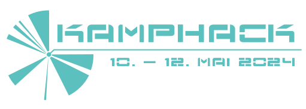

---

## Einleitung

Wir freuen uns, euch zum KampHack 2024 in Münster einzuladen!  
Dieses einzigartige Hacker-Event wird von der [Warpzone e.V.](https://warpzone.ms/perma_about/) organisiert und findet in dessen Räumen und denen des KCM's am Hawerkamp statt.  
Es ist die perfekte Gelegenheit, sich mit technikinteressierten Wesen auszutauschen, Neues zu lernen, sowie gemeinsam zu hacken und zu basteln.

### Location

**Haus G, Am Hawerkamp 31, 48155 Münster**

### Was euch erwartet:

- **Spannende Talks und Workshops:** Zu Themen rund um Elektronik, Informatik, Physik und vieles mehr.

- **Hackcenter:** Ein Platz zum hacken und basteln mit allerlei Elektronikwerkzeug, Messgeräten, Lötequipment und mehr. Bringt eure Projekte mit!

- **Chillout-Lounge:** Genießt kreative Pausen mit Waffeln, Popcorn, Mate und connected mit anderen Teilnehmer*innen.

### Für wen ist der KampHack?

Jeder ist willkommen!  
Aber besonders viel Spaß wirst du bei uns haben, wenn du dich für IT, Elektronik, Physik, Mathe, Netzpolitik, digitale Kunst, Computerspiele, ... interessierst.

---

## Tickets:

- Dieses Jahr gibt es Tagestickets für den KampHack

- Die maximale Teilnehmer*innenzahl beträgt 60 Wesen / Tag

- Der Preis wird sich auf ca. 10€ / Tag belaufen

- Im Ticket ist Frühstück und Abendessen enthalten

 
**Bitte schaue zu einem späteren Zeitpunkt vorbei, um ein Ticket zu kaufen.**

---

## FAQ

- **Wie sieht es mit Verpflegung aus?**  

    Wir werden täglich ein langes Frühstück und veganes Abendessen bereitstellen.  
    Getränke werden zu Selbstkosten (1 - 1,50€) bereitgestellt.  
    Meist gibt es noch Waffeln und Popcorn!

- **Was ist die Warpzone?**  

    Die Warpzone e.V. ist ein Hackerspace und der Veranstalter des KampHacks. Mehr Informationen [hier](https://warpzone.ms/perma_about/).

- **Ich war noch nie in einem Hackerspace, darf ich trotzdem kommen?**  

    Klar! Der KampHack ist eine prima Gelegenheit mal einen örtlichen Hackerspace kennenzulernen. Es ist egal, ob du schon Vorkenntnisse hast, oder einfach nur zuschauen und andere Leute treffen möchtest - Wir sind offen für alle!

- **Ab wie viel Uhr kann ich kommen?**  

    Aktuell haben wir noch keine Öffnungszeiten erarbeitet. Rechne aber mal damit, dass wir die Tür ab ca. 12uhr öffnen.

- **Ich möchte einen Vortrag oder einen Workshop halten**  

    Super! Klick doch bitte in der Navigation auf CfP und bewerbe dich.

- **Was soll / kann /darf ich mitbringen??**  

    - Mehrfachsteckdosen für die Stromversorgung an den Tischen
    - IP-Fähiges Gerät (z.B. Laptop)
    - Viele bunte LED's
    - DECT-Telefon
    - Bastelprojekte (Wenn du Starkstrom benötigst klär das bitte mit der Orga unter verwaltung@warpzone.ms ab)

- **Was ist zum basteln vorhanden?**  

    - Diverse Lötstationen (Konventionell, Heißluft, Entlöt, Portabel, Ofen)...
    - Digitales Mikroskop
    - Netzteile
    - Oszilloskope
    - Käbelchen
    - Akku schweiß Gerät
    - 3D-Drucker
    - Diverse Programmer (z.B. ST-Link)
    - uvm.

- **Ich möchte ein Kunstprojekt ausstellen**  

    Super! Über Kunst freuen wir uns immer. Bitte melde dein Kunstprojekt unter verwaltung@warpzone.ms an.  
    Wir haben aktuell kein Budget für Kunst eingeplant und können euch deshalb keine finanzielle Unterstützung bei einem Kunstprojekt versprechen.

- **Sind Foto- / Filmaufnahmen gestattet?**  

    Ausschließlich, wenn sich alle auf dem Foto zu erkennende Personen **vor** Anfertigung der Aufnahme damit einverstanden erklärt haben!  
    Bei aufzuzeichnenden Talks wird das Publikum **nicht** gefilmt!

- **Wie komme ich zum KampHack?**  

    Am Ende der Straße “Am Hawerkamp” findest du den ehemaligen Pebüso Industriekomplex. Die Veranstaltung findet in Haus G, dem ersten Haus auf dem Gelände, statt.  

    **Auto / Fahrrad:** Du kannst direkt vor Haus G, oder auf der Zufahrtsstraße parken.  

    **Bus:** Die näheste Haltestelle ist "Halle Münsterland". Von hier läuft man ca. 5min zum KampHack.  

    **Bahn:** Die näheste Haltestelle ist "Münster Hauptbahnhof". Von hier läuft man ca. 15min zum KampHack. Von hier kann auch ein Bus genommen werden.

- **Weitere Fragen?**

    Bei ungeklärten Fragen kannst Du uns gerne unter [verwaltung@warpzone.ms](mailto:verwaltung@warpzone.ms) kontaktieren.  

    Wir haben auch einen Matrix-Channel unter: [#KampHack:matrix.warpzone.ms](https://matrix.to/#/#KampHack:matrix.warpzone.ms)